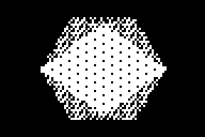

# Rend3D





### About
Many years ago while bored at work with my TI-83+ calculator I wrote a quick TI-BASIC program to draw 3D wireframes that use quaternions to randomly rotate around. Unimpressed with the very slow draw rate, I thought it would be fun to recreate it in assembly. Fast forward to 2020 and I decided to dust off this project and finally take the time to debug it and get it at least working. Some of the code is still a bit of a mess, but it does work properly as far as I can tell.
While this program was written for fun and is not especially useful by itself, I believe that some components of it may be useful for other z80 projects. Perhaps someday I will get around to separating it out in to libraries to be used directly in other projects, but for now feel free to look at the code and use pieces that may be useful to you.

### Assembling & Running
If you don't already have the means to assemble the source, this is how I have done it:
 1. Download and put the source somewhere.
 2. Download [TASM](https://www.ticalc.org/archives/files/fileinfo/250/25051.html) and put `TASM.EXE` in the `/comp` directory and `TASM80.TAB` in the main directory with the source code.
 3. Download [BinPac8x](https://www.ticalc.org/archives/files/fileinfo/429/42915.html) and put `binpac8x.py` in the `/comp` directory.
 4. Run `Start.bat` to compile each .z80 file and create the .8xp file.
 5. Load the .8xp files to your favorite calculator or emulator, run `Asm(prgmVCUBE` to select that model, then `Asm(prgmREND3D`.
Hold the Clear key to exit.

I have only tested this on a phyisical TI-83+ calculator and on the TI-83+ SE in the TI-83 Plus Flash Debugger. As far as I can tell it works properly, but, as with any random assembly programs from the internet, use at your own risk.

#### 24-bit Floating Point Numbers
Rather than rely on the calculator's built-in floating point numbers (which are essentially 9 bytes of a sort of floating point binary coded decimal) and have to use lots of system calls, I opted for a format based on a more standard float. The combinations of registers A+HL and C+DE are used as the floating point registers, similar to how z80 already combines two 8-bit registers to form the 16-bit registers. A and C contain the sign bit and exponent (with 63 as the bias), and HL or DE are the fraction bits. Essentially, `f = sgn(A) * (HL/32768) * 2^((A & 0x7F) - 63)`. The most significant bit of HL must explicitly have a "1", it is not implicit, as this simplified some of the math routines.
Additionally, multiplying two floats will result in a sort of double format, stored as A+HL+DE, where HL is the most significant bits of the fractional component and DE is the least significant bits. The format of the A register is exactly the same as before, the exponent range is not increased as with standard doubles. The only supported operation on these doubles is addition, which adds AHLDE and A'HL'DE' (the shadow register equivalent), and is useful for adding several multiplication products in sequence (such as for matrix multiplication).
##### General Math Routines:
```
fAdd -- AHL = AHL + CDE
fSub -- AHL = AHL - CDE
fMult -- AHLDE = AHL * CDE
fSquare -- AHLDE = AHL * AHL
fCube -- AHLDE = AHL * AHL * AHL
fAddAcc -- AHLDE = AHLDE + A'HL'DE'
fDiv -- AHL = AHL / CDE
fDiv2 -- AHL = AHL/2
fMult2 -- AHL = AHL*2
fDiv2CDE -- CDE = CDE/2
fMult2CDE -- CDE = CDE*2
InvSqrt -- AHL = 1/sqrt(AHL)
Sqrt1plusX -- AHL = sqrt(AHL+1)
Sqrt -- AHL = sqrt(AHL)
Log -- AHL = ln(AHL)  * A Log2 function exists within Log, but since it was never used by itself they were combined
Exp -- AHL = e^(AHL)
Pow2 -- AHL = 2^(AHL)
Sin -- AHL = sin(AHL), for -pi < AHL < pi
Cos -- AHL = cos(AHL), for -pi < AHL < pi
Acos -- AHL = Acos(AHL)
fInt -- AHL = ipart(AHL)  *ignores all fractional bits
fTrunc -- AHL = AHLDE  *rounds HL by adding the most significant bit of DE
fNormalize -- helper function to renormalize AHL (so msb of HL is 1, and adjusts A)
fCmp -- Updates flags from AHL-CDE without modifying AHL or CDE
fRand -- A random-ish number between 0.0 and 1.0
fRandAngle -- A random-ish number between -pi and pi

ftos16 -- Converts AHL to a 16-bit signed integer value in HL
ftou24 -- Converts AHL to an 24-bit unsigned intever value in AHL, with A being the most significant bits
s8tof -- Converts 8-bit signed integer value in A to a float value in AHL
```
##### Integer Functions:
```
Mult -- HLDE = HL * DE, where HL of the result is the most significant bits and DE is the least significant bits
NegHL -- Two's complement negation of HL
NegDE -- Two's complement negation of DE
Rand -- Returns a random-ish byte in A

sMultfixed -- DE = HL * DE, where all the values are 14.2 fixed-point precision (used in triangle drawing)
```
